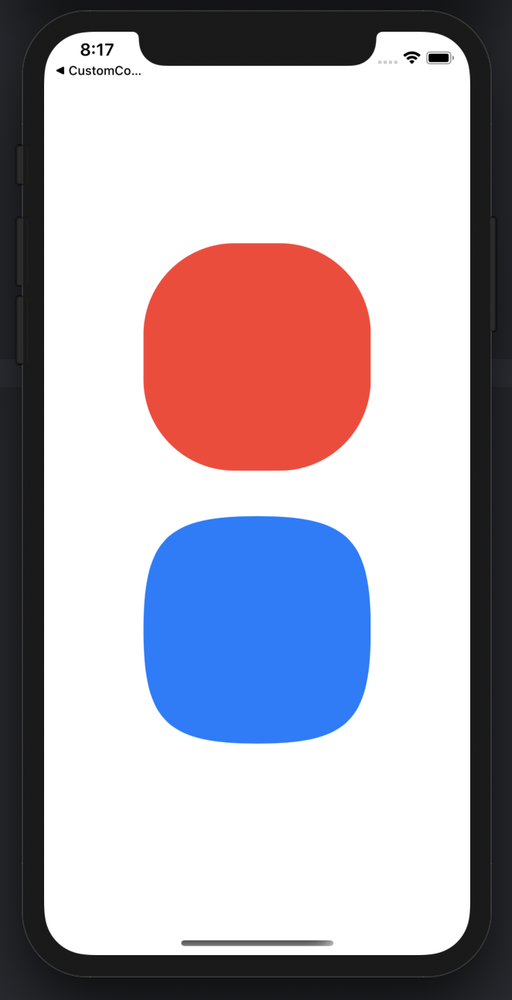

# UIBezierPath-sample

### 참조 링크

### [iOS ) UIBezierPath (1)](https://zeddios.tistory.com/814)

### [중학생도 알 수 있는 베지에 곡선](https://blog.coderifleman.com/2016/12/30/bezier-curves/)

### [Drawing Shapes Using Bézier Paths](https://developer.apple.com/library/archive/documentation/2DDrawing/Conceptual/DrawingPrintingiOS/BezierPaths/BezierPaths.html#//apple_ref/doc/uid/TP40010156-CH11-SW2)
